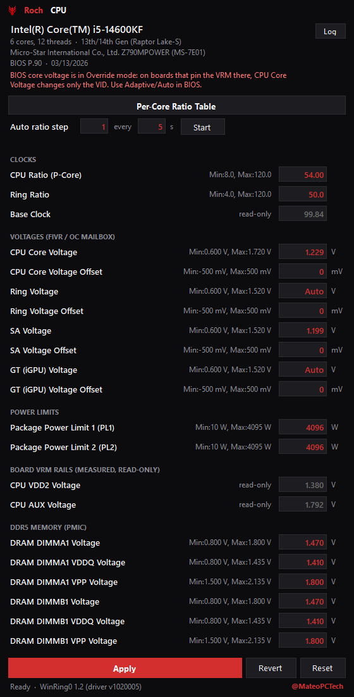

# Roch CPU

Board-independent CPU and memory tuning for **Intel LGA1700** (12th / 13th / 14th Gen Core on
any Z690 / Z790 / B660 / B760 / H670 / H770 board). The third Roch Studio tool, next to
[Roch GPU](https://github.com/RochStudio/Roch-GPU) and
[Roch Viewer](https://github.com/RochStudio/Roch-Viewer), and built in the same shape:
one dark window, typeable values, a log.

It started as a re-creation of MSI Dragon Power that does not need an MSI board. Dragon
Power talks to MSI-specific VRM controllers; Roch CPU only uses interfaces that every
LGA1700 CPU and every Intel 600/700-series chipset expose the same way.



> Writing ratios and voltages can crash the machine, corrupt work in progress, and in the
> extreme damage hardware. Nothing here persists across a reboot, but a bad value applied
> to a DIMM or a core is live the moment you press Apply.

## What it drives

| Control | Path | Works on |
|---|---|---|
| CPU ratio (all-core, plus the per-active-core-count table) | MSR 0x1AD / 0x1AE | boards with an unlocked multiplier (Z-series + K CPU). Non-Z boards set *OC Lock* and the writes are rejected; the window says so. |
| E-core ratio | MSR 0x650 | same |
| Ring ratio | OC mailbox ring domain + MSR 0x620 (the MSR alone is ignored on Alder/Raptor Lake) | same |
| Core / E-core L2 / Ring / SA / GT voltage, offset or static override | Intel OC mailbox (MSR 0x150) through the CPU's own SVID path | every board unless the BIOS disables the mailbox or sets *Undervolt Protection*. The VRM must be following SVID: with the BIOS core voltage in **Override** mode, MSI boards fix the VRM output and a VID change from here goes nowhere; use **Adaptive** or **Auto** in the BIOS (see below) |
| PL1 / PL2 package power limits | MSR 0x610 | every board unless locked in BIOS |
| DDR5 VDD / VDDQ / VPP per DIMM | the PMIC on each module over the PCH SMBus | any board whose BIOS leaves the SMBus visible; vendor-locked (*secure mode*) PMICs read but refuse writes |
| Base clock | measured, TSC against the ACPI timer | read-only everywhere (see below) |
| Temperature, VID, clock, package power, DRAM rail power | MSRs / PMIC | every board |
| Measured Vcore, used to check that a core-voltage apply actually reached the rail | Super I/O over LPC: Nuvoton NCT6683/6686/6687, Nuvoton NCT679x, or ITE IT86xx/87xx | boards carrying one of those chips; on anything else the check is skipped and the tool still runs |
| CPU VDD2 and CPU AUX, live values | Nuvoton NCT6687D over LPC | read-only, and only on the MSI EC parts where the channel mapping is verified. See below for why these two cannot be set |

Board-specific VRM rails that Dragon Power *sets* (CPU VDD2, CPU 1.05, CPU AUX, PCH 0.82)
cannot be set here: they are produced by the motherboard's voltage regulators and have no
CPU-side register at all, so writing them means driving that board's specific VRM controller.
They are shown as live read-only values instead, straight from the Super I/O. BCLK is
read-only for the same kind of reason; programming it goes through the Intel ICC firmware
interface that MSI wraps in its proprietary `IccSdk.dll`. The measured value is the real one:
an MSI board that displays 100.01 in Dragon Power runs at 99.84.

### Two ways to set a CPU voltage, and why only one of them is portable

A CPU voltage can be changed from either end of the SVID link:

* **Ask the CPU** to request a different voltage, through the OC mailbox. That is what Roch
  CPU does, and it needs no knowledge of the board. It only works if the VRM is actually
  following the CPU's request.
* **Tell the VRM** what to output, by writing the regulator's own set-point. That always
  works, but it requires knowing which controller the board uses, on which bus, at which
  address, with which encoding. Get any of those wrong and you can put an arbitrary voltage
  into the CPU.

Dragon Power takes the second route. Its SMBus engine ships two extra bus masters beside the
Intel one (every call has `n_` and `b_` variants) and takes a mutex named
`Access_SMBUS.HTP.Renesas.Method`, which names the VRM controller family it drives. So Dragon
Power is not doing something Roch CPU does badly, it is doing a different, board-specific thing.

That private path was chased as far as it can be observed from outside the driver, on a
Z790MPOWER with Dragon Power driven under automation while every visible bus was diffed:

* The regulator does not answer on the PCH SMBus. Dumping all 256 registers of every device
  that acknowledges, before and after a Vcore change, shows movement only in the DDR5 PMIC's
  own sensor bytes.
* The Nuvoton EC does mirror the set-point: `0x470` holds the offset from the BIOS Vcore as a
  signed millivolt byte (1.250 V reads `0xE2` = −30, 1.350 V reads `70`). But it is only a
  mirror. Writing it, with or without the `0x471` enable byte and with a clean 0→5 transition,
  is accepted and reads back, and the rail does not move.
* Nothing else in the EC's whole 256-page space tracks the set-point.
* **CPU VDD2 and CPU AUX go the same way.** Driving Dragon Power's VDD2 field under automation
  and diffing the EC shows VDD2 landing in that *same* `0x470` slot, but with a different
  encoding: `(mV - 1100) / 10` (1.400 V reads 30, 1.440 V reads 34, 1.480 V reads 38), against
  Vcore's 1 mV/LSB from 1280. One slot, two encodings, means `0x470` is a shared command
  parameter and the rail identity travels separately. Writing it with the correct VDD2 encoding
  is accepted and reads back, and the rail stays put — the same dead end as Vcore.

So the write leaves through MSI's kernel driver on a bus that is not visible from either the
PCH SMBus or the Super I/O. Replicating it means reverse-engineering that driver's protocol
and then writing a VR controller whose register map and encoding would be guesswork. Roch CPU
does not do that: a wrong register on an unverified regulator puts an arbitrary voltage into
the CPU, and there is no read-back that would catch it before the damage.

That matters when the BIOS core voltage mode is **Override**: MSI then pins the VRM output at
the BIOS value and the CPU's VID request is ignored, so Dragon Power still works and any
CPU-side tool does nothing. Measured on a Z790MPOWER in Override mode, all four request paths
moved the VID (one by 125 mV) while the rail sat at 1.284 V +/- 1 mV. Switching the BIOS to
Adaptive fixes it completely — see below.

**The fix, confirmed on the bench:** set **CPU Core Voltage Mode** to `Adaptive Mode` and leave
**CPU Core Voltage** itself on `Auto`, then reboot — the mode only takes effect on the next boot.
On a Z790MPOWER that turns every path from dead to exact: an override moved the VID +100 mV and
the measured rail +98 mV, and the offset paths tracked to the millivolt. The VID-to-rail gap
falls from 55 mV (pinned) to 14 mV (ordinary load-line droop). An explicit value left in the
CPU Core Voltage field pins the VRM even with the mode set to Adaptive, which looks identical
to the Override case.

Until then Roch CPU will not pretend otherwise. Applying a core voltage measures the VID the
CPU now requests against the rail the Super I/O actually reports: if the request moved and the
rail did not, the row is marked **board ignored it**, the apply counts as failed, and the log
says why. It also reads the mailbox at start-up and warns in the header when the BIOS left the
core voltage in Override mode.

## Boards

Everything except the rail measurement is a CPU or Intel-chipset feature, so it does not care
who made the board: the ratios and voltages are model-specific registers and the Intel OC
mailbox, and the DDR5 rails are the JEDEC PMIC on each module reached over the PCH SMBus.

The one board-specific piece is the Super I/O that measures real Vcore, which is what lets an
apply be checked against the rail instead of trusting that the CPU's request was honoured:

| Super I/O family | Chips | Typically |
|---|---|---|
| Nuvoton, EC address space | NCT6683D, NCT6686D, NCT6687D | MSI 600/700-series |
| Nuvoton, banked registers | NCT6791D … NCT6799D | ASUS, some ASRock and Gigabyte |
| ITE | IT86xx, IT87xx | Gigabyte, some ASRock |

An unrecognised chip is not an error: the tool runs, the rail check is skipped, and the log
says which chip it found. Only the NCT6687D path has been exercised against real hardware;
the other two are written from the documented register layouts and are untested. `--sio-dump`
prints every channel if you want to check one.

## Requirements

* Windows 10/11 x64, run **as administrator** (the manifest asks for elevation).
* [.NET 8 Desktop Runtime](https://dotnet.microsoft.com/download/dotnet/8.0), or build
  self-contained (below).
* `WinRing0x64.sys` beside the executable; the build copies it. This is the OpenLibSys
  WinRing0 1.2 driver used by OpenHardwareMonitor, Fan Control and others.
  * Windows **Memory Integrity (Core Isolation)** or the vulnerable-driver blocklist may
    refuse to load it. The window then shows a warning and every row reads N/A.
  * Defender sometimes flags WinRing0 as a *HackTool*. It is a plain MSR / port-I/O driver;
    the SHA-256 of the bundled file is
    `11BD2C9F9E2397C9A16E0990E4ED2CF0679498FE0FD418A3DFDAC60B5C160EE5`.
  * The service is created on demand and removed when Roch CPU exits. If a previous instance
    was killed, the next one adopts the leftover service and removes it on its own exit.

## Building

```bash
build.cmd
```

produces `dist\Roch CPU.exe` (framework-dependent). For a build that does not need the
.NET runtime installed:

```bash
build.cmd --self-contained
```

Or directly: `dotnet publish src/RochPower -c Release -o dist`.

### Self-test without the window

```bash
"dist\Roch CPU.exe" --probe report.txt
```

writes a report with every register the tool relies on (topology, turbo tables, mailbox
domains, PL1/PL2, BCLK, SMBus, DIMM PMIC registers, the ADC calibration) plus no-op write
checks that rewrite the current values. Attach it when reporting a board that misbehaves.

`--vtest report.txt` goes one step further: it nudges the core voltage by 10–40 mV and the
ring ratio down by one, checks that the CPU follows (VID, ring ratio under load, package
power under an all-core load), and restores the exact previous values. Use it when a control
seems to do nothing.

`--vcore-test report.txt` is the sharpest one: it raises the core voltage request by 60 mV,
measures the rail the VRM actually produces, restores the previous setting, and states plainly
whether the board follows the CPU.

`--smbus-scan`, `--sio-dump`, `--ec-dump` and `--ec-peek` are the read-only probes used to work
the above out: devices on the PCH SMBus, the Super I/O voltage channels, the whole EC space, and
named EC registers. Use them when porting to a board with a different sensor chip.

## Using it

* Every row is one line: a name, the allowed range, and a typeable value in red. Type a value
  and press **Apply** (or Enter). The window sizes itself to hold every row, so nothing
  scrolls. Controls this system does not have are hidden rather than greyed out, which is why
  the E-core rows disappear when E-cores are off.
* **0** in any field restores the value captured when Roch CPU started; a voltage override
  goes back to *Auto* (adaptive).
* **Revert** re-reads the hardware into the fields. **Reset** writes the start-up values back.
* **Per-Core Ratio Table** opens the turbo table: the multiplier allowed for 1, 2, … N active
  P-cores and for each E-core group.
* **Auto ratio step** raises the CPU ratio by *step* every *interval* seconds until a write is
  rejected or you press Stop (F6). Run a stress test beside it to find the limit.
* **Log** opens the log window, which explains every failure: a locked MSR, a value the mailbox
  rejected, a PMIC in secure mode, an SMBus hidden by the BIOS, a driver Windows would not load.

The status line under the buttons says what the last Apply did.

## Safety

* Voltages above the usual daily-use range trigger a confirmation. Nothing stops you from
  confirming; you own the hardware.
* DDR5 PMIC register scales differ between kits: on overclocking kits the VDD register uses
  10 mV steps instead of the JEDEC 5 mV, which would double a voltage written with the wrong
  scale. Roch CPU measures every rail with the PMIC's own ADC at start-up, only enables
  writing on rails whose scale matches, and verifies each write by reading the register back
  **and** re-measuring with the ADC. A vendor-locked PMIC cannot be calibrated, so its rows
  stay read-only.
* Ratios and voltages set here are not persistent: a reboot returns to BIOS values.

## Layout

```
src/RochPower/Hardware   driver client (WinRing0), MSR/CPU, OC mailbox, PCH SMBus, DDR5 PMIC, SMBIOS, BCLK meter
src/RochPower/Core       settings model, hardware model
src/RochPower/UI         theme, main window, per-core dialog, log window
drivers/                 WinRing0x64.sys (signed, extracted from LibreHardwareMonitorLib 0.9.4)
assets/                  the Roch mark, icon
```

`IKernelDriver` is the only thing the rest of the code talks to, so another ring-0 backend
(PawnIO, a vendor driver) can be dropped in without touching the UI.

## Validated on

MSI Z790MPOWER (BIOS P.90) with an i5-14600KF and a DDR5 kit at 1.470 / 1.410 / 1.800 V.
Every reading was cross-checked against MSI Dragon Power on the same machine. Two things that
came out of that: the OC mailbox's SA voltage lives in domain 4 on Raptor Lake (documentation
usually says 3), and the VDD register scale above.
