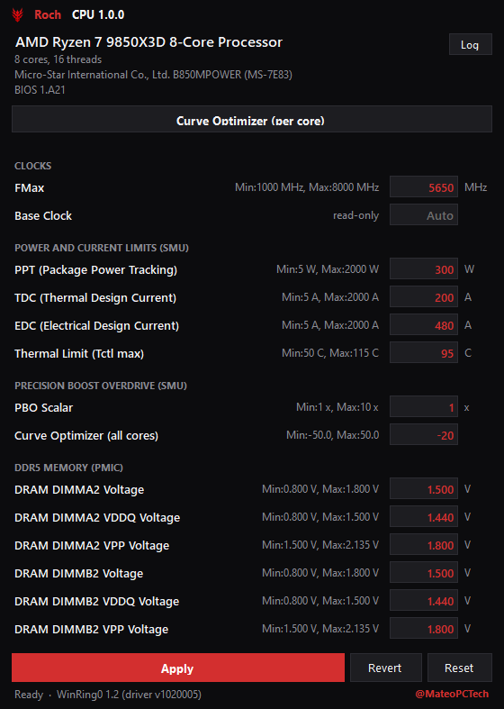

# Roch CPU

A Windows CPU and DDR5 memory tuning tool for supported Intel LGA1700 and AMD Ryzen systems. Adjust clocks, power limits, voltages and Curve Optimizer in a compact light/dark interface. Available controls depend on your hardware and BIOS.

## Install

1. Download the package from [Releases](https://github.com/RochStudio/Roch-CPU/releases).
2. Extract the entire folder—keep the bundled driver and support files beside `Roch CPU.exe`.
3. Run `Roch CPU.exe` as administrator. Current-source framework-dependent builds need the **.NET 10 Desktop Runtime (x64)**; self-contained builds do not. Older releases targeting .NET 8 still need the .NET 8 runtime.

Windows 10/11 x64 is required. If Windows blocks a driver, some controls will be unavailable.

## Features

- **Intel tuning:** supported core, E-core and ring ratios, voltage offsets/overrides, and PL1/PL2 power limits. BIOS locks and CPU/chipset restrictions still apply.
- **AMD Ryzen tuning:** PPT, TDC, EDC, thermal limit, PBO scalar and supported FMax controls through the SMU.
- **Per-core Curve Optimizer:** edit individual AMD core offsets, refresh hardware readings and apply changes from a dedicated window.
- **DDR5 memory voltages:** per-DIMM VDD, VDDQ and VPP controls where the PMIC permits writes, with calibration and read-back checks.
- **Board-specific controls:** base clock and CPU VDD2 on supported MSI Intel 600/700-series boards. AMD BCLK writing is not enabled on the tested B850MPOWER.
- **Light and dark modes:** grouped clock, power, boost and memory sections, editable values and a log explaining rejected or unavailable settings.
- **Social links:** YouTube | X | Discord in the bottom-left footer, matching Roch Viewer.
- **Apply, Revert and Reset:** Apply writes your edits; Revert reloads hardware readings; Reset restores the tool's startup baseline where supported.

Controls vary by processor, motherboard, BIOS and driver access. Optional [PawnIO](https://pawnio.eu) enables AMD SMU power-table read-back for PPT/TDC/EDC; Roch CPU does not install it automatically. See the [hardware reference](docs/reference.md) for platform details.

## Screenshots

<p align="center">
  
  
</p>

Left: Intel example from an earlier build. Right: Roch CPU 1.0.2 on an AMD Ryzen 7 9850X3D, showing the current grouped layout. Available rows follow the detected hardware. Displayed settings are examples, not tuning recommendations.

## Build the latest source

Install the **.NET 10 SDK**, then run:

```bat
build.cmd --self-contained
```

Open `dist\Roch CPU.exe`. The current version is **1.0.2**.

> Overclocking can cause crashes, data loss or hardware damage. Change one setting at a time and test stability. Read-back checks do not prove a setting is stable.

## Credits

- **Ivan Rusanov — [ZenStates-Core](https://github.com/irusanov/ZenStates-Core), ZenStates and SMUDebugTool:** references for AMD SMU messages, mailbox addresses and Curve Optimizer core mapping.
- **[OpenLibSys / Noriyuki Miyazaki](THIRD-PARTY-NOTICES.md#winring0-driverswinring0x64sys):** the bundled WinRing0 low-level access driver.
- **[LibreHardwareMonitor](https://github.com/LibreHardwareMonitor/LibreHardwareMonitor):** Super I/O register/access references and the source package for the bundled WinRing0 binary.
- **namazso — [PawnIO](https://pawnio.eu) and [PawnIO.Modules](https://github.com/namazso/PawnIO.Modules):** optional driver access and the bundled signed RyzenSMU module for AMD power-table reads.
- **[ryzen_smu](https://gitlab.com/leogx9r/ryzen_smu):** AMD SMN access reference.

Created by **Roch Studio / [@MateoPCTech](https://x.com/MateoPCTech)**. See [third-party notices](THIRD-PARTY-NOTICES.md) for attribution, component licenses and implementation details.

[YouTube](https://www.youtube.com/@MateoPcTech) | [X](https://x.com/MateoPCTech) | [Discord](https://discord.gg/KfzExpKQHB)

[Hardware details](docs/reference.md) · [BCLK investigation](docs/b850mpower-bclk-investigation.md) · [License](LICENSE)
