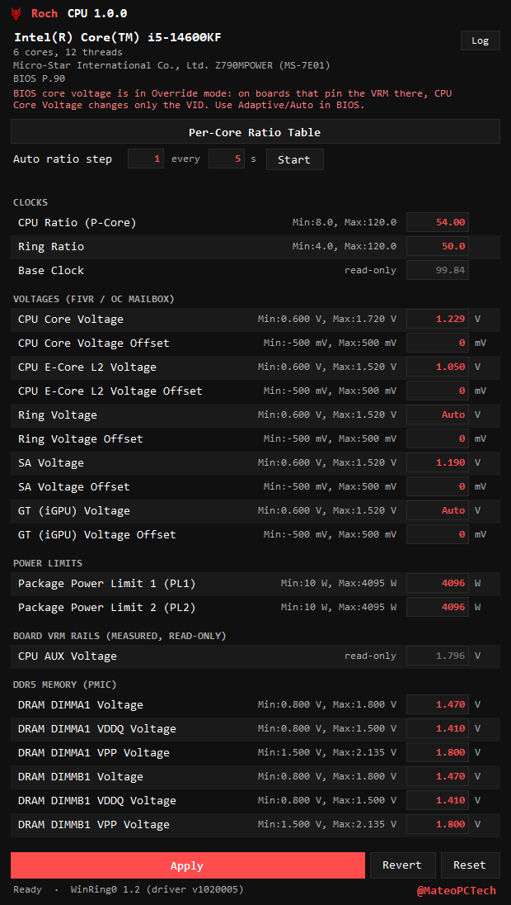
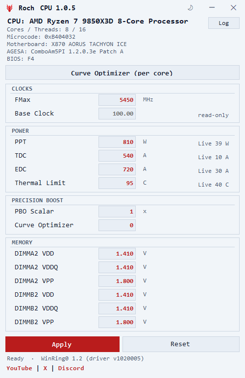

# Roch CPU

A Windows CPU and DDR5 memory tuning tool for supported Intel LGA1700 and AMD Ryzen systems. Adjust clocks, power limits, voltages and Curve Optimizer in a compact light/dark interface. Available controls depend on your hardware and BIOS.

## Install

1. Download the package from [Releases](https://github.com/RochStudio/Roch-CPU/releases).
2. Extract the entire folder—keep the bundled driver and support files beside `Roch CPU.exe`.
3. Run `Roch CPU.exe` as administrator. Current-source framework-dependent builds need the **.NET 10 Desktop Runtime (x64)**; self-contained builds do not. Older releases targeting .NET 8 still need the .NET 8 runtime.

Windows 10/11 x64 is required. If Windows blocks a driver, some controls will be unavailable.

## Features

- **Intel tuning:** supported core, E-core and ring ratios, voltage offsets/overrides, and PL1/PL2 power limits. BIOS locks and CPU/chipset restrictions still apply.
- **AMD Ryzen tuning:** PPT, TDC, EDC, thermal limit, PBO scalar and supported FMax controls through the SMU. With PawnIO installed, each limit row also shows the live draw (watts, amps, temperature); without it the app says so and links to pawnio.eu.
- **Per-core Curve Optimizer:** edit individual AMD core offsets, refresh hardware readings and apply changes from a dedicated window.
- **DDR5 memory voltages:** per-DIMM VDD, VDDQ and VPP controls where the PMIC permits writes, with calibration and read-back checks.
- **Board-specific controls:** CPU Core override, base clock and CPU VDD2 on supported MSI Intel 600/700-series boards. Core override updates both the Renesas regulator and Intel OC mailbox, with read-back and rail verification. AMD BCLK writing is not enabled on the tested B850MPOWER.
- **Light and dark modes:** light by default, switched with the sun/moon button beside minimize. Grouped clock, power, boost and memory sections in a compact window, allowed ranges in each row's tooltip, and a log explaining rejected or unavailable settings.
- **Social links:** YouTube | X | Discord in the bottom-left footer, matching Roch Viewer.
- **Hardware-read header:** CPU, core/thread topology, microcode, motherboard, AGESA (AMD) and BIOS values are labeled consistently above the controls. On AMD the Base Clock row shows the measured BCLK (read-only).
- **Intel voltage read-back:** programmed Core, E-core L2, Ring, SA and GT targets are shown when firmware supplies them. On supported MSI boards, Core displays the regulator target rather than a potentially stale mailbox-only value; an adaptive Ring with no encoded target displays the real shared IA/core-rail voltage instead of `Auto`.
- **Apply and Reset:** Apply writes your edits; Reset restores the tool's startup baseline where supported.

Controls vary by processor, motherboard, BIOS and driver access. Optional [PawnIO](https://pawnio.eu) enables AMD SMU power-table read-back for PPT/TDC/EDC; Roch CPU does not install it automatically. See the [hardware reference](docs/reference.md) for platform details.

## Screenshots

<p align="center">
  
  
</p>

Left: Roch CPU 1.0.3 on an Intel Core i5-14600KF / Z790MPOWER, including the board-backed Core override and numeric adaptive Ring voltage. Right: Roch CPU 1.0.5 on an AMD Ryzen 7 9850X3D / X870 AORUS TACHYON ICE in the default light theme, with the AGESA version, measured base clock and live PPT/TDC/EDC/temperature readings (PawnIO installed). Available rows follow the detected hardware. Displayed settings are examples, not tuning recommendations.

## Build the latest source

Install the **.NET 10 SDK**, then run:

```bat
build.cmd --self-contained
```

Open `dist\Roch CPU.exe`. The current version is **1.0.5**.

### Intel write verification

Voltage requests are checked against the OC mailbox response. Rejected or ignored targets
produce an error and an attempt to restore the previous mailbox value. Ratio and power
register writes are also read back; the UI says **read back**, which verifies the stored
request, not sustained clocks or physical voltage. Live VID is shown separately from the
editable voltage target; VID is a CPU request, not a measured Vcore rail.
Supported Super I/O monitors provide a separate live Vcore reading. ASUS NCT6798D
detection uses chip ID `0xD42B` and verifies the monitor vendor ID before reading it.
Noisy rail samples report an unverified response without asserting a firmware cause.

On the validated ASUS Z790-A GAMING WIFI D4 configuration, CPU Core uses ASUS's
Global Core SVID Manual mode through the installed ASUS control service. Complete
mode/target/offset readback and rollback protect against a partially applied request.
The live Vcore reading comes from ASUS hardware monitoring. A 1.300 V target produced
about 1.341 V measured in testing; requested voltage is not a promise of exact rail voltage.
The ASUS voltage row labels the editable value as a target and shows measured Vcore
and its difference from the applied target immediately below. Unsaved edits are not
used as the comparison target, and no automatic compensation is applied.
The ASUS CPU VRM offset control has been removed. SA and CPU E-core L2 targets now
use the dedicated ASUS board controls, with rail-specific metadata validation,
complete state readback and rollback. Both were tested at 1.100 V and restored to
Auto: measured SA was about 1.089 V and L2 about 1.104 V. Their own sensor readings
are logged after applying; these are separate from Vcore.
Ring voltage uses ASUS Cache SVID with complete state readback and rollback. A
temporary 1.300 V request was verified in both ASUS state and the CPU cache-domain
register, then restored to Auto; ring ratio remained 50x. Ring and cores share
Vcore, so this is a requested target, not a separate measured ring supply.
Board rail rows require a validated sensor mapping. MSI VDD2/AUX channel labels
are no longer incorrectly displayed on the ASUS DDR4 board.
The original MSI regulator path is preserved. ASUS BCLK remains read-only: the vendor
target accepted changes in testing while the physical clock stayed unchanged.
See [ASUS validation notes](docs/asus-z790-validation.md) for results and dependencies.

When a hypervisor is detected, the app warns that register values may be virtualized.
Windows VBS/Memory Integrity and BIOS policy can restrict tuning. The app does not disable
security features or bypass BIOS locks. See [Intel's VBS compatibility guidance](https://www.intel.com/content/www/us/en/support/articles/000093813/processors/processor-utilities-and-programs.html).

`--probe` collects readings without tuning writes. `--intel-audit` collects per-thread
register data. `--intel-validate 1.3` is an explicit hardware test: it briefly lowers the
P-core ceiling under a single-thread load, tests the current E-core table and a 1.300 V
mailbox target, and restores the captured P-core and voltage settings. It refuses to run
with another Roch CPU instance open. When a Vcore monitor is available, it also records
settled measurements before the override, with it applied, and after restoration.
Voltage readback alone does not establish physical Vcore.

Ring control uses MSR `0x620` and additionally updates a populated ring mailbox domain.
A completely empty domain no longer causes a verified ring-register write to be rolled
back. This preserves the mailbox path used on MSI boards. `--ring-validate` briefly lowers
the ring ceiling, checks the running ring ratio, and restores the original register. It
requires one Roch CPU instance and writes `ring-validation.txt` beside the executable.
The header displays live P-core, E-core and ring ratios separately from their limits.

E-core control preserves unused zero entries in the turbo table. Boards exposing a
single active entry update that entry; fully populated tables continue to update all
groups. The per-core editor disables unused groups instead of programming them.

When Hyper-V is active, the app checks Windows event 12550 from the current boot.
If Windows explicitly reports restricted writes to the voltage mailbox, voltage rows
are disabled with the recorded cause. This leaves P-core and ring control available.
Old events from previous boots do not disable controls. `--windows-audit` exports this
evidence without opening the kernel driver. `--ecore-validate 44` briefly tests the E-core
target and restores its table; it requires one instance and permits at most a one-step
increase above the current ceiling, with an absolute test maximum of 44.

Regression checks use a simulated driver and never open the hardware driver:

```bat
dotnet run --project tests\RochPower.Tests -c Release
```

> Overclocking can cause crashes, data loss or hardware damage. Change one setting at a time and test stability. Read-back checks do not prove a setting is stable.

## Credits

- **Ivan Rusanov — [ZenStates-Core](https://github.com/irusanov/ZenStates-Core), ZenStates and SMUDebugTool:** references for AMD SMU messages, mailbox addresses and Curve Optimizer core mapping.
- **[OpenLibSys / Noriyuki Miyazaki](THIRD-PARTY-NOTICES.md#winring0-driverswinring0x64sys):** the bundled WinRing0 low-level access driver.
- **[LibreHardwareMonitor](https://github.com/LibreHardwareMonitor/LibreHardwareMonitor):** Super I/O register/access references and the source package for the bundled WinRing0 binary.
- **namazso — [PawnIO](https://pawnio.eu) and [PawnIO.Modules](https://github.com/namazso/PawnIO.Modules):** optional driver access and the bundled signed RyzenSMU module for AMD power-table reads.
- **[ryzen_smu](https://gitlab.com/leogx9r/ryzen_smu):** AMD SMN access reference.

Created by **Roch Studio / [@MateoPCTech](https://x.com/MateoPCTech)**. See [third-party notices](THIRD-PARTY-NOTICES.md) for attribution, component licenses and implementation details.

[YouTube](https://www.youtube.com/@MateoPcTech) | [X](https://x.com/MateoPCTech) | [Discord](https://discord.gg/KfzExpKQHB)

[Hardware details](docs/reference.md) · [BCLK investigation](docs/b850mpower-bclk-investigation.md) · [License](LICENSE)
